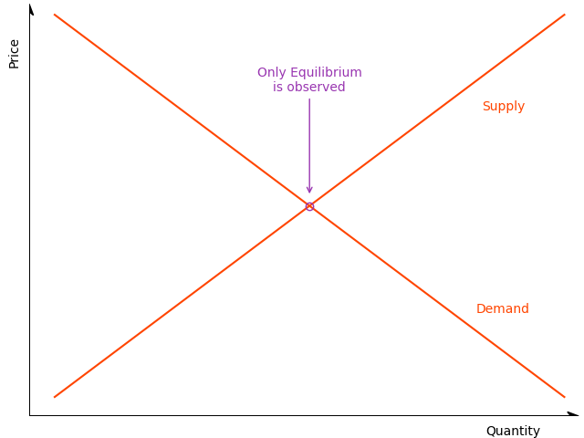

```{r, include = FALSE}
knitr::opts_chunk$set(
  collapse = TRUE,
  comment = "#>",
  out.width = "80%"
)
```

# Models For Markets in Disequilibrium  

<style>
body { text-align:justify; }
</style>

<!-- badges: start -->
<!-- badges: end -->

The *diseq* package provides tools to estimate and analyze an equilibrium and four disequilibrium models. The equilibrium model can be estimated with either two-stage least squares or with full information maximum likelihood. The methods are asymptotically equivalent. The disequilibrium models are estimated using full information maximum likelihood. The likelihoods can be estimated both with independent and correlated demand and supply shocks and the optimization of the likelihoods can be performed either using analytic expressions or numerical approximations of their gradients.

## A quick model tour

The five models of the package are described by systems of simultaneous equations, with the equilibrium system being the only linear, while the disequilibrium systems being non-linear. All models specify the demand and the supply side of the market by a linear (in parameters) equation. The remaining equations of each model, if any, further specify the structure of the market. 

### The equilibrium model

The equilibrium model adds the market-clearing condition to the demand and supply equations of the system. For the system to be identifiable, at least one variable in the demand side must not be present in the supply side and vice versa. This model assumes that the market observations always represent equilibrium points in which the demanded and supplied quantities are equal. 

<div style='text-align:center;display:inline-block;width:100%'>
<div style='width:49%;float:left;margin:auto;'>
\begin{equation}
\begin{aligned}
D_{nt} &= X_{d,nt}'\beta_{d} + P_{nt}\alpha_{d} + u_{d,nt}, \\
S_{nt} &= X_{s,nt}'\beta_{s} + P_{nt}\alpha_{s} + u_{s,nt}, \\
Q_{nt} &= D_{nt} = S_{nt} .
\end{aligned} \tag{EM} \label{eq:model:equilibrium}
\end{equation}
</div>

</div>

### The basic disequilibrium model

The basic model is the simplest disequilibrium model of the package as it basically imposes no assumption on the structure of the market regarding price movements. In contrast with the equilibrium model, the market-clearing condition is replaced by the short-side rule, which stipulates that the minimum between the demanded and supplied quantities is observed. The econometrician does not need to specify whether an observation belongs to the demand or the supply side since the estimation of the model will allocate the observations on the demand or supply side so that the likelihood is maximized.

<div style='text-align:center;display:inline-block;width:100%'>
<div style='width:49%;float:left;margin:auto;'>
\begin{equation}
\begin{aligned}
D_{nt} &= X_{d,nt}'\beta_{d} + u_{d,nt}, \\
S_{nt} &= X_{s,nt}'\beta_{s} + u_{s,nt}, \\
Q_{nt} &= \min\{D_{nt},S_{nt}\} .
\end{aligned} \tag{BM} \label{eq:model:basic}
\end{equation}
</div>

</div>

### The directional disequilibrium model

The directional model attaches an additional equation to the system of the basic model. The added equation is a sample separation condition based on the direction of the price movements. When prices increase at a given date, an observation is assumed to belong on the supply side. When prices fall, an observation is assumed to belong in the demand side. In short, this condition separates the sample before the estimation and uses this separation as additional information in the estimation procedure. Although, when appropriate, more information improves estimations, it also, when inaccurate, intensifies misspecification problems. Therefore, the additional structure of the directional model does not guarantee better estimates in comparison with the basic model.

<div style='text-align:center;display:inline-block;width:100%'>
<div style='width:49%;float:left;margin:auto;'>
\begin{equation}
\begin{aligned}
D_{nt} &= X_{d,nt}'\beta_{d} + u_{d,nt}, \\
S_{nt} &= X_{s,nt}'\beta_{s} + u_{s,nt}, \\
Q_{nt} &= \min\{D_{nt},S_{nt}\}, \\
\Delta P_{nt} &\ge 0 \implies D_{nt} \ge S_{nt}.
\end{aligned} \tag{DM} \label{eq:model:directional}
\end{equation}
</div>

</div>

### A disequilibrium model with deterministic price dynamics

The separation rule of the directional model classifies observations on the demand or supply-side based in a binary fashion, which is not always flexible, as observations that correspond to large shortages/surpluses are treated the same with observations that correspond to small shortages/ surpluses. The deterministic adjustment model of the package replaces this binary separation rule with a quantitative one. The magnitude of the price movements is analogous to the magnitude of deviations from the market-clearing condition. This model offers a flexible estimation alternative, with one extra degree of freedom in the estimation of price dynamics, that accounts for market forces that are in alignment with standard economic reasoning. By letting $\gamma$ approach zero, the equilibrium model can be obtained as a limiting case of this model.

<div style='text-align:center;display:inline-block;width:100%'>
<div style='width:49%;float:left;margin:auto;'>
\begin{equation}
\begin{aligned}
D_{nt} &= X_{d,nt}'\beta_{d} + P_{nt}\alpha_{d} + u_{d,nt}, \\
S_{nt} &= X_{s,nt}'\beta_{s} + P_{nt}\alpha_{s} + u_{s,nt}, \\
Q_{nt} &= \min\{D_{nt},S_{nt}\}, \\
\Delta P_{nt} &= \frac{1}{\gamma} \left( D_{nt} - S_{nt} \right).
\end{aligned} \tag{DA} \label{eq:model:deterministic_adjustment}
\end{equation}
</div>

</div>

### A disequilibrium model with stochastic price dynamics

The last model of the package extends the price dynamics of the deterministic adjustment model by adding additional explanatory variables and a stochastic term. The latter term in particular makes the price adjustment mechanism stochastic and, deviating from the structural assumptions of models $(DA)$ and $(DM)$, abstains from imposing any separation assumption on the sample. The estimation of this model offers the highest degree of freedom, accompanied, however, by a significant increase in estimation complexity, which can hinder the stability of the procedure and the numerical accuracy of the outcomes. 

<div style='text-align:center;display:inline-block;width:100%'>
<div style='width:49%;float:left;margin:auto;'>
\begin{equation}
\begin{aligned}
D_{nt} &= X_{d,nt}'\beta_{d} + P_{nt}\alpha_{d} + u_{d,nt}, \\
S_{nt} &= X_{s,nt}'\beta_{s} + P_{nt}\alpha_{s} + u_{s,nt}, \\
Q_{nt} &= \min\{D_{nt},S_{nt}\}, \\
\Delta P_{nt} &= \frac{1}{\gamma} \left( D_{nt} - S_{nt} \right) +  X_{p,nt}'\beta_{p} + u_{p,nt}. 
\end{aligned} \tag{SA} \label{eq:model:stochastic_adjustment}
\end{equation}
</div>

</div>

## Installation

The released version of [*diseq*](https://CRAN.R-project.org/package=diseq) can be installed from [CRAN](https://CRAN.R-project.org) with:

```r
install.packages("diseq")
```

The source code of the in-development version can be download from [GitHub](https://github.com/pi-kappa-devel/diseq).

After installing it, there is a basic-usage example installed with it. To see it type the command
```r
vignette('basic_usage')
```

You can find the documentation of the package by typing
```r
?? diseq
```

## A practical example

This is a basic example that illustrates how a model of the package can be estimated. The package is loaded in the standard way.

```{r loading}
library(diseq)
```

The example uses simulated data. The *diseq* package offers a function to simulate data from data generating processes that correspond to the models that the package provides.
```{r simulation}
model_tbl <- simulate_model_data(
  "diseq_basic", 10000, 5,
  -1.9, 12.9, c(2.1, -0.7), c(3.5, 6.25),
  2.8, 10.2, c(0.65), c(1.15, 4.2),
  NA, NA, c(NA),
  seed = 42
)
```

Models are initialized by a constructor. In this example, a basic disequilibrium model is estimated. There are also other models available (see [Design and functionality]). The constructor sets the model's parameters and performs the necessary initialization processes. The following variables specify this example's parameterization.

 * The key is the combination of columns that uniquely identify a record of the dataset. For panel data, this should be a vector of the entity identifier and the time columns.
```{r model.parameters.key}
key_columns <- c("id", "date")
```
 
 * The quantity variable.
```{r model.parameters.quantity}
quantity_column <- "Q"
```

 * The price variable. 
```{r model.parameters.price}
price_column <- "P"
```

 * The specification of the system's equations. Each specification sets the right hand side of one system equation. The expressions are specified similarly to the expressions of formulas of linear models. Indicator variables and interactions are created automatically by the constructor. 
```{r model.parameters.equations}
demand_specification <- paste0(price_column, " + Xd1 + Xd2 + X1 + X2")
supply_specification <- "Xs1 + X1 + X2"
```

 * The verbosity level controls the level of messaging. The object displays
     * error: always,
     * warning: $\ge$ 1, 
     * info: $\ge$ 2, 
     * verbose: $\ge$ 3 and
     * debug: $\ge$ 4.
```{r model.parameters.verbose}
verbose <- 0
```

 * Should the model estimation allow for correlated demand and supply shocks?
```{r model.parameters.correlated_shocks}
use_correlated_shocks <- TRUE
```

```{r model.initialize}
mdl <- new(
  "diseq_basic",
  key_columns,
  quantity_column, price_column, demand_specification, paste0(price_column, " + ", supply_specification),
  model_tbl,
  use_correlated_shocks = use_correlated_shocks, verbose = verbose
)
```

The model is estimated with default options by a simple call. See the documentation of `estimate` for more 
details and options.
```{r model.estimation}
est <- estimate(mdl, use_heteroscedasticity_consistent_errors = TRUE)
bbmle::summary(est)
```
## Design and functionality

The equilibrium model can be estimated either using two-stage least squares or full information maximum likelihood. The two methods are asymptotically equivalent. The classes that implement these estimation techniques are respectively

* `eq_2sls` and
* `eq_fiml`.

In total, there are four disequilibrium models, which are all estimated using full information maximum likelihood. By default, the estimations use analytically calculated gradient expressions, but the user has the ability to override this behavior. The classes that implement the four disequilibrium models are 

* `diseq_basic`, 
* `diseq_directional`, 
* `diseq_deterministic_adjustment`, and
* `diseq_stochastic_adjustment`.

The package organizes these classes in a simple object oriented hierarchy. 
<div style="width:100%;text-align:center">

</div>

Concerning post estimation analysis, the package offers functionality to calculate

* shortage probabilities,
* marginal effects on shortage probabilities,
* point estimates of normalized shortages,
* point estimates of relative shortages,
* aggregate demand and supply,
* post-estimation classification of observations in demand and supply,
* heteroscedasticity adjusted (Huber-White) standard errors. 

## Alternative packages

The estimation of the basic model is also supported by the package [_Disequilibrium_](https://CRAN.R-project.org/package=Disequilibrium). By default the _Disequilibrium_ package numerically approximates the gradient when optimizing the likelihood. In contrast, _diseq_ uses analytically calculated expressions for the likelihood, which can reduce the duration of estimating the model. In addition, it allows the user to override this behavior and use the numerically approximated gradient. There is no alternative package that supports the out-of-the-box estimation of the other three disequilibrium models of _diseq_. 

## Planned extensions

The package is planned to be expanded in two ways. 

* Firstly, it should become more inclusive by adding additional models and methods for the estimation of markets and their forces. 
* Secondly, the implementation is currently written directly in _R_ and is single-threaded using only one processor for the estimations of the models. For the numerically intensive likelihood optimizations that the package employs, this results to extended execution times when the models are estimated using large datasets. The estimation of the models should be gradually re-implemented in _C++_ using a concurrent design. 

## Contributors

Pantelis Karapanagiotis 

Feel free to join, share, contribute, distribute.

## License

The code is distributed under the MIT License. 
