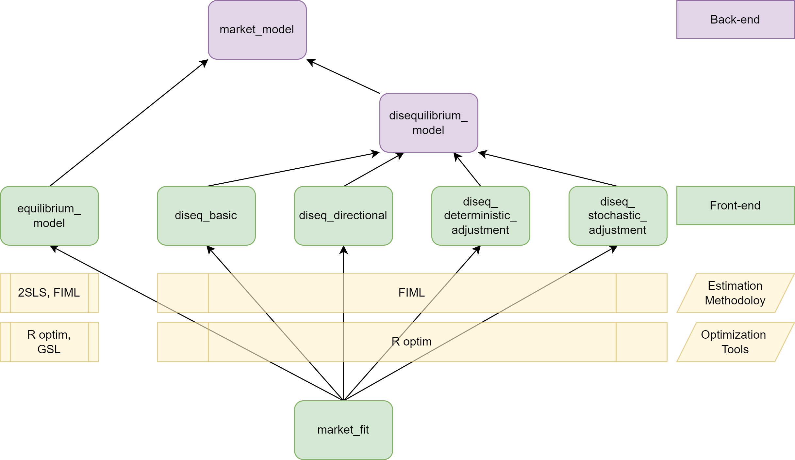

```{r, include = FALSE}
knitr::opts_chunk$set(
  collapse = TRUE,
  comment = "#>",
  fig.path = "man/figures/README-",
  out.width = "100%"
)
```

# Models for Markets in Disequilibrium  

<!-- badges: start -->
<!-- badges: end -->

The diseq package provides tools to estimate and analyze an equilibrium and four disequilibrium models. The equilibrium model can be estimated with either two-stage least squares or with full information maximum likelihood. The methods are asymptotically equivalent. The disequilibrium models are estimated using full information maximum likelihood. All maximum likelihood models can be estimated both with independent and correlated demand and supply shocks.

## Installation
<!--
You can install the released version of diseq from [CRAN](https://CRAN.R-project.org) with:

``` r
install.packages("diseq")
```
--> 
You can download the source code of the development version from [GitHub](https://github.com/pi-kappa-devel/diseq).

After you install it, there is a basic-usage example installed with it. To see it type the command
```
vignette('basic_usage')
```

You can find the documentation of the package by typing
```
?? diseq
```

## Example

This is a basic example which shows you how to estimate a model. The package is loaded in the standard way.

```{r loading}
library(diseq)
```

The example uses simulated data. The diseq package offers a function to simulate data from data generating processes that correspond to the models that the package provides.
```{r simulation}
model_tbl <- simulate_model_data(
  "diseq_basic", 10000, 5,
  -1.9, 12.9, c(2.1, -0.7), c(3.5, 6.25),
  2.8, 10.2, c(0.65), c(1.15, 4.2),
  NA, NA, c(NA),
  seed = 42
)
```

Models are initialized by a constructor. In this example, a basic disequilibrium model is estimated. There are also other models available (see [Design and functionality]). The constructor sets the model's parameters and performs the necessary initialization processes. The following variables specify this example's parameterization.

 * The key is the combination of columns that uniquely identify a record of the dataset. For panel data, this should be a vector of the entity identifier and the time columns.
```{r model.parameters.key}
key_columns <- c("id", "date")
```
 
 * The quantity variable.
```{r model.parameters.quantity}
quantity_column <- "Q"
```

 * The price variable. 
```{r model.parameters.price}
price_column <- "P"
```

 * The sepecification of the system's equations. Each specification sets the right hand side of one system equation. The expressions are specified similarly to the expressions of formulas of linear models. Indicator variables and interactions are created automatically by the constructor. 
```{r model.parameters.equations}
demand_specification <- paste0(price_column, " + Xd1 + Xd2 + X1 + X2")
supply_specification <- "Xs1 + X1 + X2"
```

 * The verbosity level controls the level of messaging. The object displays
     * error: always,
     * warning: $\ge$ 1, 
     * info: $\ge$ 2, 
     * verbose: $\ge$ 3 and
     * debug: $\ge$ 4.
```{r model.parameters.verbose}
verbose <- 0
```

 * Should the model estimation allow for correlated demand and supply shocks?
```{r model.parameters.correlated_shocks}
use_correlated_shocks <- TRUE
```

```{r model.initialize}
mdl <- new(
  "diseq_basic",
  key_columns,
  quantity_column, price_column, demand_specification, paste0(price_column, " + ", supply_specification),
  model_tbl,
  use_correlated_shocks = use_correlated_shocks, verbose = verbose
)
```

The model is estimated with default options by a simple call. See the documentation of `estimate` for more 
details and options.
```{r model.estimation}
est <- estimate(mdl)
bbmle::summary(est)
```

## Design and functionality

There are two equilibrium models available, namely

* `eq_2sls` and
* `eq_fiml`.

In total, there are four disequilibrium models, i.e.

* `diseq_basic`, 
* `diseq_directional`, 
* `diseq_deterministic_adjustment`, and
* `diseq_stochastic_adjustment`.

The package organizes the models in a simple object oriented hierarchy. 



Concerning post estimation analysis, the package offers functionality to calculate

* shortage probabilities,
* marginal effects on shortage probabilities,
* point estimates of normalized shortages,
* point estimates of relative shortages,
* aggregate demand and supply,
* post-estimation classification of observations in demand and supply.

## Contributors

Pantelis Karapanagiotis 

Feel free to join, share, contribute, distribute.

## License

The code is distributed under the MIT License. 
