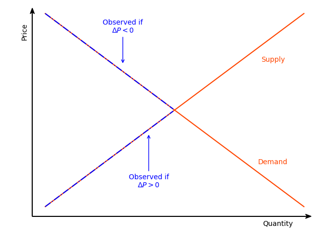
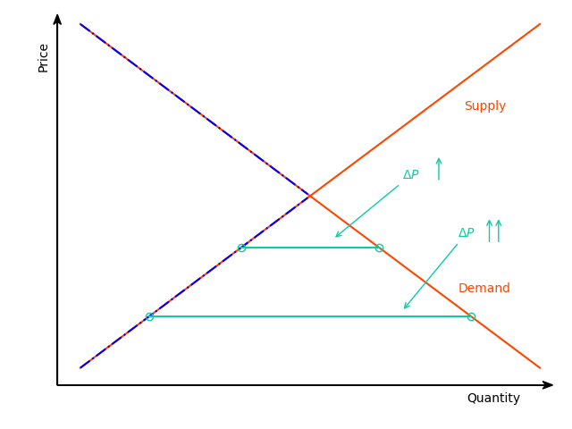

<!-- badges: start -->


<!-- badges: end -->

The *diseq* package provides tools to estimate and analyze an equilibrium and four disequilibrium models. The equilibrium model can be estimated with either two-stage least squares or with full information maximum likelihood. The methods are asymptotically equivalent. The disequilibrium models are estimated using full information maximum likelihood. The likelihoods can be estimated both with independent and correlated demand and supply shocks and the optimization of the likelihoods can be performed either using analytic expressions or numerical approximations of their gradients.

# A quick model tour

The five models of the package are described by systems of simultaneous equations, with the equilibrium system being the only linear, while the disequilibrium systems being non-linear. All models specify the demand and the supply side of the market by a linear (in parameters) equation. The remaining equations of each model, if any, further specify the structure of the market. 

## The equilibrium model

The equilibrium model adds the market-clearing condition to the demand and supply equations of the system. For the system to be identifiable, at least one variable in the demand side must not be present in the supply side and vice versa. This model assumes that the market observations always represent equilibrium points in which the demanded and supplied quantities are equal. The model can be estimated using two-stage least squares [@theil1953] or full information maximum likelihood [@karapanagiotis2020invisible]. Asymptotically, these methods are equivalent [@balestra1987].

$$
\begin{equation}
\begin{aligned}
D_{n t} &= X_{d, n t}'\beta_{d} + P_{n t}\alpha_{d} + u_{d, n t} \\
S_{n t} &= X_{s, n t}'\beta_{s} + P_{n t}\alpha_{s} + u_{s, n t} \\
Q_{n t} &= D_{n t} = S_{n t}
\end{aligned} \tag{EM} \label{equilibrium}
\end{equation}
$$


## The basic disequilibrium model

The basic model is the simplest disequilibrium model of the package as it basically imposes no assumption on the structure of the market regarding price movements [@fair1972; @maddala1974]. In contrast with the equilibrium model, the market-clearing condition is replaced by the short-side rule, which stipulates that the minimum between the demanded and supplied quantities is observed. The econometrician does not need to specify whether an observation belongs to the demand or the supply side since the estimation of the model will allocate the observations on the demand or supply side so that the likelihood is maximized.

$$
\begin{equation}
\begin{aligned}
D_{n t} &= X_{d, n t}'\beta_{d} + u_{d, n t} \\
S_{n t} &= X_{s, n t}'\beta_{s} + u_{s, n t} \\
Q_{n t} &= \min\{D_{n t},S_{n t}\}
\end{aligned} \tag{BM} \label{basic}
\end{equation}
$$


## The directional disequilibrium model

The directional model attaches an additional equation to the system of the basic model. The added equation is a sample separation condition based on the direction of the price movements [@fair1972; @maddala1974]. When prices increase at a given date, an observation is assumed to belong on the supply side. When prices fall, an observation is assumed to belong in the demand side. In short, this condition separates the sample before the estimation and uses this separation as additional information in the estimation procedure. Although, when appropriate, more information improves estimations, it also, when inaccurate, intensifies misspecification problems. Therefore, the additional structure of the directional model does not guarantee better estimates in comparison with the basic model.

$$
\begin{equation}
\begin{aligned}
D_{n t} &= X_{d, n t}'\beta_{d} + u_{d, n t} \\
S_{n t} &= X_{s, n t}'\beta_{s} + u_{s, n t} \\
Q_{n t} &= \min\{D_{n t},S_{n t}\} \\
\Delta P_{n t} &\ge 0 \implies D_{n t} \ge S_{n t}
\end{aligned} \tag{DM} \label{directional}
\end{equation}
$$


## A disequilibrium model with deterministic price dynamics

The separation rule of the directional model classifies observations on the demand or supply-side based in a binary fashion, which is not always flexible, as observations that correspond to large shortages/surpluses are treated the same with observations that correspond to small shortages/ surpluses. The deterministic adjustment model of the package replaces this binary separation rule with a quantitative one [@fair1972; @maddala1974]. The magnitude of the price movements is analogous to the magnitude of deviations from the market-clearing condition. This model offers a flexible estimation alternative, with one extra degree of freedom in the estimation of price dynamics, that accounts for market forces that are in alignment with standard economic reasoning. By letting $\gamma$ approach zero, the equilibrium model can be obtained as a limiting case of this model.

$$
\begin{equation}
\begin{aligned}
D_{n t} &= X_{d, n t}'\beta_{d} + P_{n t}\alpha_{d} + u_{d, n t} \\
S_{n t} &= X_{s, n t}'\beta_{s} + P_{n t}\alpha_{s} + u_{s, n t} \\
Q_{n t} &= \min\{D_{n t},S_{n t}\} \\
\Delta P_{n t} &= \frac{1}{\gamma} \left( D_{n t} - S_{n t} \right)
\end{aligned} \tag{DA} \label{deterministic_adjustment}
\end{equation}
$$


## A disequilibrium model with stochastic price dynamics

The last model of the package extends the price dynamics of the deterministic adjustment model by adding additional explanatory variables and a stochastic term. The latter term in particular makes the price adjustment mechanism stochastic and, deviating from the structural assumptions of models $(DA)$ and $(DM)$, abstains from imposing any separation assumption on the sample [@maddala1974; @quandt1978estimating]. The estimation of this model offers the highest degree of freedom, accompanied, however, by a significant increase in estimation complexity, which can hinder the stability of the procedure and the numerical accuracy of the outcomes. 

$$
\begin{equation}
\begin{aligned}
D_{n t} &= X_{d, n t}'\beta_{d} + P_{n t}\alpha_{d} + u_{d, n t} \\
S_{n t} &= X_{s, n t}'\beta_{s} + P_{n t}\alpha_{s} + u_{s, n t} \\
Q_{n t} &= \min\{D_{n t},S_{n t}\} \\
\Delta P_{n t} &= \frac{1}{\gamma} \left( D_{n t} - S_{n t} \right) +  X_{p, n t}'\beta_{p} + u_{p, n t}
\end{aligned} \tag{SA} \label{stochastic_adjustment}
\end{equation}
$$


# Installation and documentation

The released version of [*diseq*](https://CRAN.R-project.org/package=diseq) can be installed from [CRAN](https://CRAN.R-project.org) with:

```r
install.packages("diseq")
```

The source code of the in-development version can be download from [GitHub](https://github.com/pi-kappa-devel/diseq).

After installing it, there is a basic-usage example installed with it. To see it type the command
```r
vignette('basic_usage')
```

Online documentation is available for both the [released](https://www.diseq.pikappa.eu) and [in-development](https://www.diseq.pikappa.eu/dev/) versions of the package. The documentation files can also accessed in `R` by typing
```r
?? diseq
```
An overview of the package's functionality was presented in the session Trends, Markets, Models of the [useR!2021](https://user2021.r-project.org/) conference. The recording of the session, including the talk for this package, can be found in the video that follows. The presentation slides of the talk are also available [here](https://talks.pikappa.eu/useR!2021/).

<iframe width="560" height="315" src="https://www.youtube.com/embed/Kkjkny94dgU" title="YouTube video player" frameborder="0" allow="accelerometer; autoplay; clipboard-write; encrypted-media; gyroscope; picture-in-picture" allowfullscreen></iframe>

# A practical example

This is a basic example that illustrates how a model of the package can be estimated. The package is loaded in the standard way.

```{r loading}
library(diseq)
```

The example uses simulated data. The *diseq* package offers a function to simulate data from data generating processes that correspond to the models that the package provides.
```{r simulation}
model_tbl <- simulate_data(
  "diseq_basic", 10000, 5,
  -1.9, 12.9, c(2.1, -0.7), c(3.5, 6.25),
  2.8, 10.2, c(0.65), c(1.15, 4.2),
  NA, NA, c(NA),
  seed = 42
)
```

Models are initialized by a constructor. In this example, a basic disequilibrium model is estimated. There are also other models available (see [Design and functionality]). The constructor sets the model's parameters and performs the necessary initialization processes. The following variables specify this example's parameterization.

 * The models can be estimated both with panel and time series data. The constructor expects both a subject and a time identifier in order to perform the necessary initialization operations (these are respectively given by `id` and `date` in the simulated data of this example). The observation identification of the data is automatically generated by composing the subject and time identifiers. The resulting composite key is the combination of columns that uniquely identify a record of the dataset. 
 
 * The observable traded quantity variable (given by `Q` in this example's simulated data). The demanded and supplied quantities are not observable and they identified either based on the market clearing condition or the short side rule. 

 * The price variable, which is named after `P` in the simulated data. 

 * The right hand side specifications of the demand and supply equations. The expressions are specified similarly to the expressions of formulas of linear models. Indicator variables and interactions are created automatically by the constructor. 

 * The verbosity level controls the level of messaging. The object displays
     * error: always,
     * warning: &GreaterEqual; 1, 
     * info: &GreaterEqual; 2, 
     * verbose: &GreaterEqual; 3 and
     * debug: &GreaterEqual; 4.
```{r model.parameters.verbose}
verbose <- 0
```

 * Should the model estimation allow for correlated demand and supply shocks?
```{r model.parameters.correlated_shocks}
correlated_shocks <- TRUE
```

```{r model.initialize}
mdl <- new(
  "diseq_basic",
  subject = id, time = date, quantity = Q, price = P,
  demand = P + Xd1 + Xd2 + X1 + X2, supply = P + Xs1 + X1 + X2,
  model_tbl,
  correlated_shocks = correlated_shocks, verbose = verbose
)
```

The model is estimated with default options by a simple call. See the documentation of `estimate` for more 
details and options.
```{r model.estimation}
est <- estimate(mdl)
summary(est)
```
# Design and functionality

The equilibrium model can be estimated either using two-stage least squares or full information maximum likelihood. The two methods are asymptotically equivalent. The class for which both of these estimation methods are implemented is

* `equilibrium_model`.

In total, there are four disequilibrium models, which are all estimated using full information maximum likelihood. By default, the estimations use analytically calculated gradient expressions, but the user has the ability to override this behavior. The classes that implement the four disequilibrium models are 

* `diseq_basic`, 
* `diseq_directional`, 
* `diseq_deterministic_adjustment`, and
* `diseq_stochastic_adjustment`.

The package organizes these classes in a simple object oriented hierarchy. 


Concerning post estimation analysis, the package offers functionality to calculate

* shortage probabilities,
* marginal effects on shortage probabilities,
* point estimates of normalized shortages,
* point estimates of relative shortages,
* aggregate demand and supply,
* post-estimation classification of observations in demand and supply,
* heteroscedasticity-adjusted (Huber-White) standard errors, and 
* clustered standard errors.

# Alternative packages

The estimation of the basic model is also supported by the package [_Disequilibrium_](https://CRAN.R-project.org/package=Disequilibrium). By default the _Disequilibrium_ package numerically approximates the gradient when optimizing the likelihood. In contrast, _diseq_ uses analytically calculated expressions for the likelihood, which can reduce the duration of estimating the model. In addition, it allows the user to override this behavior and use the numerically approximated gradient. There is no alternative package that supports the out-of-the-box estimation of the other three disequilibrium models of _diseq_. 

# Planned extensions

The package is planned to be expanded in the following ways: 

1. The package should become more inclusive by adding additional market models. 
2. Single-command functionality for the market-clearing tests (e.g. [@karapanagiotis2020invisible; @hwang1980; @quandt1978tests]) should be included in the package.
3. Alternative estimation methods (e.g [@zilinskas2006; @quandt1978estimating]) could also be implemented.

# Contributors

[Pantelis Karapanagiotis](https://www.pikappa.eu)

Feel free to join, share, contribute, distribute.

# License

The code is distributed under the MIT License. 

# References
