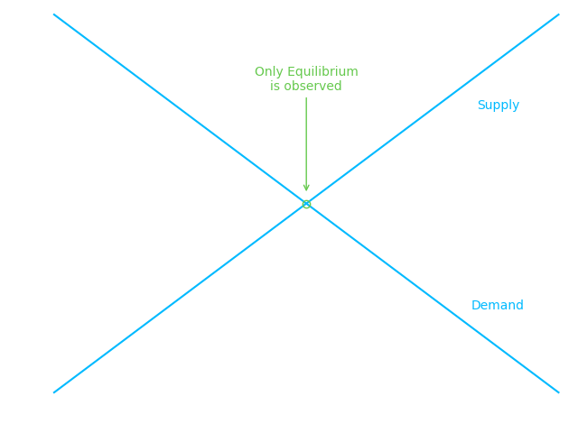
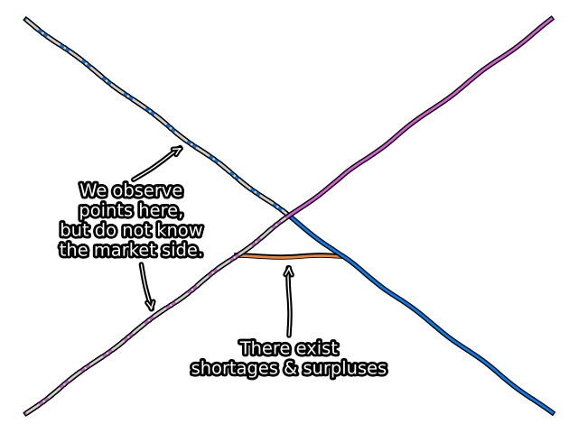
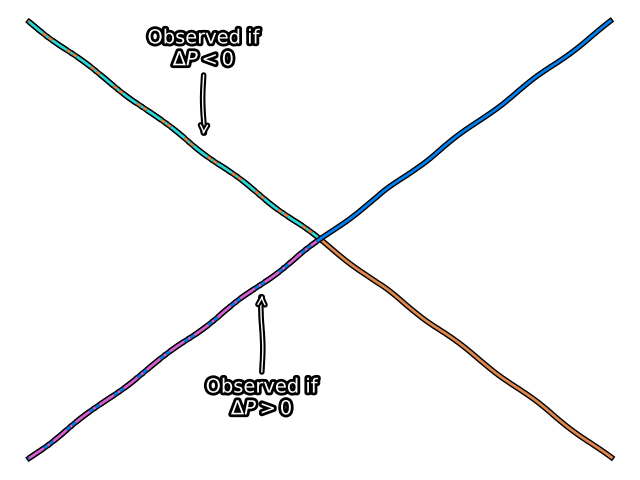
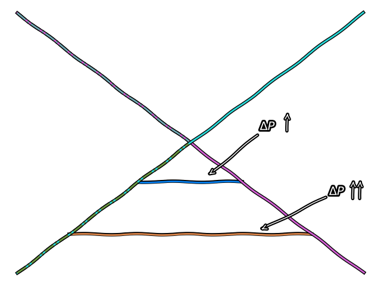
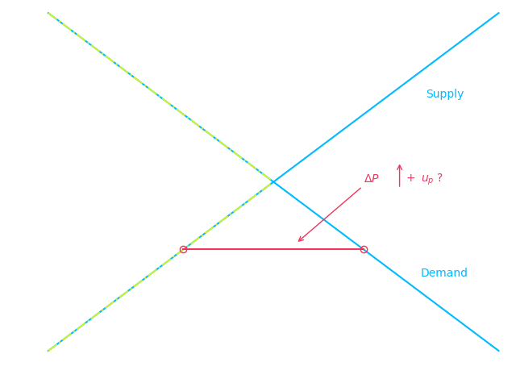
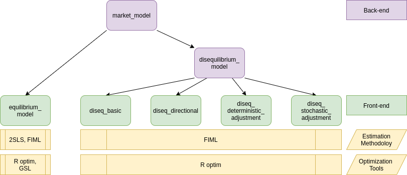

Models For Markets in Equilibrium and Disequilibrium
================


<!-- badges: start -->


 
<!-- badges: end -->

The *diseq* package provides tools to estimate and analyze an
equilibrium and four disequilibrium models. The equilibrium model can be
estimated with either two-stage least squares or with full information
maximum likelihood. The methods are asymptotically equivalent. The
disequilibrium models are estimated using full information maximum
likelihood. The likelihoods can be estimated both with independent and
correlated demand and supply shocks and the optimization of the
likelihoods can be performed either using analytic expressions or
numerical approximations of their gradients.

# A quick model tour

The five models of the package are described by systems of simultaneous
equations, with the equilibrium system being the only linear, while the
disequilibrium systems being non-linear. All models specify the demand
and the supply side of the market by a linear (in parameters) equation.
The remaining equations of each model, if any, further specify the
structure of the market.

## The equilibrium model

The equilibrium model adds the market-clearing condition to the demand
and supply equations of the system. For the system to be identifiable,
at least one variable in the demand side must not be present in the
supply side and vice versa. This model assumes that the market
observations always represent equilibrium points in which the demanded
and supplied quantities are equal.

\[
\begin{equation}
\begin{aligned}
D_{n t} &= X_{d, n t}'\beta_{d} + P_{n t}\alpha_{d} + u_{d, n t} \\
S_{n t} &= X_{s, n t}'\beta_{s} + P_{n t}\alpha_{s} + u_{s, n t} \\
Q_{n t} &= D_{n t} = S_{n t}
\end{aligned} \tag{EM} \label{equilibrium}
\end{equation}
\] 

## The basic disequilibrium model

The basic model is the simplest disequilibrium model of the package as
it basically imposes no assumption on the structure of the market
regarding price movements. In contrast with the equilibrium model, the
market-clearing condition is replaced by the short-side rule, which
stipulates that the minimum between the demanded and supplied quantities
is observed. The econometrician does not need to specify whether an
observation belongs to the demand or the supply side since the
estimation of the model will allocate the observations on the demand or
supply side so that the likelihood is maximized.

\[
\begin{equation}
\begin{aligned}
D_{n t} &= X_{d, n t}'\beta_{d} + u_{d, n t} \\
S_{n t} &= X_{s, n t}'\beta_{s} + u_{s, n t} \\
Q_{n t} &= \min\{D_{n t},S_{n t}\}
\end{aligned} \tag{BM} \label{basic}
\end{equation}
\] 

## The directional disequilibrium model

The directional model attaches an additional equation to the system of
the basic model. The added equation is a sample separation condition
based on the direction of the price movements. When prices increase at a
given date, an observation is assumed to belong on the supply side. When
prices fall, an observation is assumed to belong in the demand side. In
short, this condition separates the sample before the estimation and
uses this separation as additional information in the estimation
procedure. Although, when appropriate, more information improves
estimations, it also, when inaccurate, intensifies misspecification
problems. Therefore, the additional structure of the directional model
does not guarantee better estimates in comparison with the basic model.

\[
\begin{equation}
\begin{aligned}
D_{n t} &= X_{d, n t}'\beta_{d} + u_{d, n t} \\
S_{n t} &= X_{s, n t}'\beta_{s} + u_{s, n t} \\
Q_{n t} &= \min\{D_{n t},S_{n t}\} \\
\Delta P_{n t} &\ge 0 \implies D_{n t} \ge S_{n t}
\end{aligned} \tag{DM} \label{directional}
\end{equation}
\] 

## A disequilibrium model with deterministic price dynamics

The separation rule of the directional model classifies observations on
the demand or supply-side based in a binary fashion, which is not always
flexible, as observations that correspond to large shortages/surpluses
are treated the same with observations that correspond to small
shortages/ surpluses. The deterministic adjustment model of the package
replaces this binary separation rule with a quantitative one. The
magnitude of the price movements is analogous to the magnitude of
deviations from the market-clearing condition. This model offers a
flexible estimation alternative, with one extra degree of freedom in the
estimation of price dynamics, that accounts for market forces that are
in alignment with standard economic reasoning. By letting \(\gamma\)
approach zero, the equilibrium model can be obtained as a limiting case
of this model.

\[
\begin{equation}
\begin{aligned}
D_{n t} &= X_{d, n t}'\beta_{d} + P_{n t}\alpha_{d} + u_{d, n t} \\
S_{n t} &= X_{s, n t}'\beta_{s} + P_{n t}\alpha_{s} + u_{s, n t} \\
Q_{n t} &= \min\{D_{n t},S_{n t}\} \\
\Delta P_{n t} &= \frac{1}{\gamma} \left( D_{n t} - S_{n t} \right)
\end{aligned} \tag{DA} \label{deterministic_adjustment}
\end{equation}
\] 

## A disequilibrium model with stochastic price dynamics

The last model of the package extends the price dynamics of the
deterministic adjustment model by adding additional explanatory
variables and a stochastic term. The latter term in particular makes the
price adjustment mechanism stochastic and, deviating from the structural
assumptions of models \((DA)\) and \((DM)\), abstains from imposing any
separation assumption on the sample. The estimation of this model offers
the highest degree of freedom, accompanied, however, by a significant
increase in estimation complexity, which can hinder the stability of the
procedure and the numerical accuracy of the outcomes.

\[
\begin{equation}
\begin{aligned}
D_{n t} &= X_{d, n t}'\beta_{d} + P_{n t}\alpha_{d} + u_{d, n t} \\
S_{n t} &= X_{s, n t}'\beta_{s} + P_{n t}\alpha_{s} + u_{s, n t} \\
Q_{n t} &= \min\{D_{n t},S_{n t}\} \\
\Delta P_{n t} &= \frac{1}{\gamma} \left( D_{n t} - S_{n t} \right) +  X_{p, n t}'\beta_{p} + u_{p, n t}
\end{aligned} \tag{SA} \label{stochastic_adjustment}
\end{equation}
\] 

# Installation

The released version of
[*diseq*](https://CRAN.R-project.org/package=diseq) can be installed
from [CRAN](https://CRAN.R-project.org) with:

``` r
install.packages("diseq")
```

The source code of the in-development version can be download from
[GitHub](https://github.com/pi-kappa-devel/diseq).

After installing it, there is a basic-usage example installed with it.
To see it type the command

``` r
vignette('basic_usage')
```

You can find the documentation of the package by typing

``` r
?? diseq
```

# A practical example

This is a basic example that illustrates how a model of the package can
be estimated. The package is loaded in the standard way.

``` r
library(diseq)
```

The example uses simulated data. The *diseq* package offers a function
to simulate data from data generating processes that correspond to the
models that the package provides.

``` r
model_tbl <- simulate_model_data(
  "diseq_basic", 10000, 5,
  -1.9, 12.9, c(2.1, -0.7), c(3.5, 6.25),
  2.8, 10.2, c(0.65), c(1.15, 4.2),
  NA, NA, c(NA),
  seed = 42
)
```

Models are initialized by a constructor. In this example, a basic
disequilibrium model is estimated. There are also other models available
(see [Design and functionality](#design-and-functionality)). The
constructor sets the model’s parameters and performs the necessary
initialization processes. The following variables specify this example’s
parameterization.

  - The key is the combination of columns that uniquely identify a
    record of the dataset. For panel data, this should be a vector of
    the entity identifier and the time columns.

<!-- end list -->

``` r
key_columns <- c("id", "date")
```

  - The quantity variable.

<!-- end list -->

``` r
quantity_column <- "Q"
```

  - The price variable.

<!-- end list -->

``` r
price_column <- "P"
```

  - The specification of the system’s equations. Each specification sets
    the right hand side of one system equation. The expressions are
    specified similarly to the expressions of formulas of linear models.
    Indicator variables and interactions are created automatically by
    the constructor.

<!-- end list -->

``` r
demand_specification <- paste0(price_column, " + Xd1 + Xd2 + X1 + X2")
supply_specification <- "Xs1 + X1 + X2"
```

  - The verbosity level controls the level of messaging. The object
    displays
      - error: always,
      - warning: \(\ge\) 1,
      - info: \(\ge\) 2,
      - verbose: \(\ge\) 3 and
      - debug: \(\ge\) 4.

<!-- end list -->

``` r
verbose <- 0
```

  - Should the model estimation allow for correlated demand and supply
    shocks?

<!-- end list -->

``` r
use_correlated_shocks <- TRUE
```

``` r
mdl <- new(
  "diseq_basic",
  key_columns,
  quantity_column, price_column, demand_specification, paste0(price_column, " + ", supply_specification),
  model_tbl,
  use_correlated_shocks = use_correlated_shocks, verbose = verbose
)
```

The model is estimated with default options by a simple call. See the
documentation of `estimate` for more details and options.

``` r
est <- estimate(mdl)
bbmle::summary(est)
```

    ## Maximum likelihood estimation
    ## 
    ## Call:
    ## `bbmle::mle2`(list(skip.hessian = FALSE, start = c(D_P = 2.20196877751699, 
    ## D_CONST = 11.2388922841303, D_Xd1 = 0.270903396323925, D_Xd2 = -0.0866785170449159, 
    ## D_X1 = 1.44062383641357, D_X2 = 4.46769000498207, S_P = 2.19994905762293, 
    ## S_CONST = 10.2218850028638, S_Xs1 = 0.59622703822817, S_X1 = 1.43857649730766, 
    ## S_X2 = 4.46672975897316, D_VARIANCE = 1, S_VARIANCE = 1, RHO = 0
    ## ), method = "BFGS", minuslogl = function(...) minus_log_likelihood(object, ...), 
    ##     gr = function(...) gradient(object, ...)))
    ## 
    ## Coefficients:
    ##              Estimate Std. Error  z value  Pr(z)    
    ## D_P        -1.9277826  0.0643871 -29.9405 <2e-16 ***
    ## D_CONST    12.7187450  0.1665723  76.3557 <2e-16 ***
    ## D_Xd1       2.1041794  0.0386208  54.4831 <2e-16 ***
    ## D_Xd2      -0.6396308  0.0293756 -21.7742 <2e-16 ***
    ## D_X1        3.4902260  0.0398746  87.5300 <2e-16 ***
    ## D_X2        6.2935478  0.0385864 163.1028 <2e-16 ***
    ## S_P         2.8065335  0.0120090 233.7023 <2e-16 ***
    ## S_CONST    10.1644425  0.0494381 205.5993 <2e-16 ***
    ## S_Xs1       0.6782140  0.0097622  69.4737 <2e-16 ***
    ## S_X1        1.1295126  0.0104475 108.1137 <2e-16 ***
    ## S_X2        4.1981877  0.0103540 405.4635 <2e-16 ***
    ## D_VARIANCE  1.0177756  0.0303119  33.5767 <2e-16 ***
    ## S_VARIANCE  1.0026251  0.0074199 135.1273 <2e-16 ***
    ## RHO        -0.0238756  0.0376718  -0.6338 0.5262    
    ## ---
    ## Signif. codes:  0 '***' 0.001 '**' 0.01 '*' 0.05 '.' 0.1 ' ' 1
    ## 
    ## -2 log L: 138110.5

# Design and functionality

The equilibrium model can be estimated either using two-stage least
squares or full information maximum likelihood. The two methods are
asymptotically equivalent. The class for which both of these estimation
methods are implemented is

  - `equilibrium_model`.

In total, there are four disequilibrium models, which are all estimated
using full information maximum likelihood. By default, the estimations
use analytically calculated gradient expressions, but the user has the
ability to override this behavior. The classes that implement the four
disequilibrium models are

  - `diseq_basic`,
  - `diseq_directional`,
  - `diseq_deterministic_adjustment`, and
  - `diseq_stochastic_adjustment`.

The package organizes these classes in a simple object oriented
hierarchy.



Concerning post estimation analysis, the package offers functionality to
calculate

  - shortage probabilities,
  - marginal effects on shortage probabilities,
  - point estimates of normalized shortages,
  - point estimates of relative shortages,
  - aggregate demand and supply,
  - post-estimation classification of observations in demand and supply,
  - heteroscedasticity-adjusted (Huber-White) standard errors, and
  - clustered standard errors.

# Alternative packages

The estimation of the basic model is also supported by the package
[*Disequilibrium*](https://CRAN.R-project.org/package=Disequilibrium).
By default the *Disequilibrium* package numerically approximates the
gradient when optimizing the likelihood. In contrast, *diseq* uses
analytically calculated expressions for the likelihood, which can reduce
the duration of estimating the model. In addition, it allows the user to
override this behavior and use the numerically approximated gradient.
There is no alternative package that supports the out-of-the-box
estimation of the other three disequilibrium models of *diseq*.

# Planned extensions

The package is planned to be expanded in two ways.

  - Firstly, it should become more inclusive by adding additional models
    and methods for the estimation of markets and their forces.
  - Secondly, the implementation is currently written directly in *R*
    and is single-threaded using only one processor for the estimations
    of the models. For the numerically intensive likelihood
    optimizations that the package employs, this results to extended
    execution times when the models are estimated using large datasets.
    The estimation of the models should be gradually re-implemented in
    *C++* using a concurrent design.

# Contributors

Pantelis Karapanagiotis

Feel free to join, share, contribute, distribute.

# License

The code is distributed under the MIT License.
