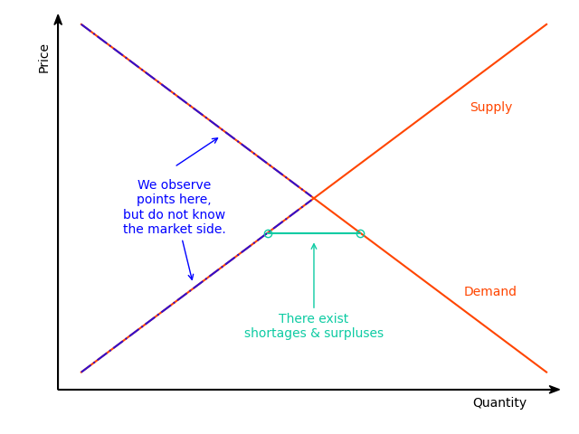

Models For Markets in Equilibrium and Disequilibrium
================


<!-- badges: start -->


<!-- badges: end -->

The *diseq* package provides tools to estimate and analyze an
equilibrium and four disequilibrium models. The equilibrium model can be
estimated with either two-stage least squares or with full information
maximum likelihood. The two methods are asymptotically equivalent. The
disequilibrium models are estimated using full information maximum
likelihood. The likelihoods can be estimated both with independent and
correlated demand and supply shocks. The optimization of the likelihoods
can be performed either using analytic expressions or numerical
approximations of their gradients.

# A quick model tour

The five models of the package are described by systems of simultaneous
equations, with the equilibrium system being the only linear one, while
the disequilibrium systems being non-linear. All models specify the
demand and the supply side of the market by a linear (in parameters)
equation. The remaining equations of each model, if any, further specify
the market structure.

## The equilibrium model

The equilibrium model adds the market-clearing condition to the demand
and supply equations of the system. For the system to be identifiable,
at least one variable in the demand side must not be present on the
supply side and vice versa. This model assumes that the market
observations always represent equilibrium points in which the demanded
and supplied quantities are equal. The model can be estimated using
two-stage least squares (Theil 1953) or full information maximum
likelihood (Karapanagiotis, n.d.). Asymptotically, these methods are
equivalent (Balestra and Varadharajan-Krishnakumar 1987).

 

## The basic disequilibrium model

The basic model is the simplest disequilibrium model of the package as
it basically imposes no assumption on the market structure regarding
price movements (Fair and Jaffee 1972; Maddala and Nelson 1974). In
contrast with the equilibrium model, the market-clearing condition is
replaced by the short-side rule, which stipulates that the minimum
between the demanded and supplied quantities is observed. The
econometrician does not need to specify whether an observation belongs
to the demand or the supply side since the estimation of the model will
allocate the observations on the demand or supply side so that the
likelihood is maximized.

 

## The directional disequilibrium model

The directional model attaches an additional equation to the system of
the basic model. The added equation is a sample separation condition
based on the direction of the price movements (Fair and Jaffee 1972;
Maddala and Nelson 1974). When prices increase at a given date, an
observation is assumed to belong on the supply side. When prices fall,
an observation is assumed to belong on the demand side. In short, this
condition separates the sample before the estimation and uses this
separation as additional information in the estimation procedure.
Although, when appropriate, more information improves estimations, it
also, when inaccurate, intensifies misspecification problems. Therefore,
the additional structure of the directional model does not guarantee
better estimates in comparison with the basic model.

 

## A disequilibrium model with deterministic price dynamics

The separation rule of the directional model classifies observations on
the demand or supply-side based in a binary fashion, which is not always
flexible, as observations that correspond to large shortages/surpluses
are treated the same with observations that correspond to small
shortages/ surpluses. The deterministic adjustment model of the package
replaces this binary separation rule with a quantitative one (Fair and
Jaffee 1972; Maddala and Nelson 1974). The magnitude of the price
movements is analogous to the magnitude of deviations from the
market-clearing condition. This model offers a flexible estimation
alternative, with one extra degree of freedom in the estimation of price
dynamics, that accounts for market forces that are in alignment with
standard economic reasoning. By letting \(\gamma\) approach zero, the
equilibrium model can be obtained as a limiting case of this model.

 

## A disequilibrium model with stochastic price dynamics

The last model of the package extends the price dynamics of the
deterministic adjustment model by adding additional explanatory
variables and a stochastic term. The latter term, in particular, makes
the price adjustment mechanism stochastic and, deviating from the
structural assumptions of models \((DA)\) and \((DM)\), abstains from
imposing any separation assumption on the sample (Maddala and Nelson
1974; Quandt and Ramsey 1978). The estimation of this model offers the
highest degree of freedom, accompanied, however, by a significant
increase in estimation complexity, which can hinder the stability of the
procedure and the numerical accuracy of the outcomes.

 

# Installation and documentation

The released version of
[*diseq*](https://CRAN.R-project.org/package=diseq) can be installed
from [CRAN](https://CRAN.R-project.org) with:

``` r
install.packages("diseq")
```

The source code of the in-development version can be downloaded from
[GitHub](https://github.com/pi-kappa-devel/diseq).

After installing it, there is a basic-usage example installed with it.
To see it type the command

``` r
vignette('basic_usage')
```

Online documentation is available for both the
[released](https://www.diseq.pikappa.eu) and
[in-development](https://www.diseq.pikappa.eu/dev/) versions of the
package. The documentation files can also be accessed in `R` by typing

``` r
?? diseq
```

An overview of the package’s functionality was presented in the session
Trends, Markets, Models of the
[useR\!2021](https://user2021.r-project.org/) conference. The recording
of the session, including the talk for this package, can be found in the
video that follows. The presentation slides of the talk are also
available [here](https://talks.pikappa.eu/useR!2021/).

<a style="display:block;margin:auto" href="https://www.youtube.com/watch?v=Kkjkny94dgU" target="_blank"></a>

# A practical example

This is a basic example that illustrates how a model of the package can
be estimated. The package is loaded in the standard way.

``` r
library(diseq)
```

The example uses simulated data. The *diseq* package offers a function
to simulate data from data generating processes that correspond to the
models that the package provides.

``` r
model_tbl <- simulate_data(
  "diseq_basic", 10000, 5,
  -1.9, 36.9, c(2.1, -0.7), c(3.5, 6.25),
  2.8, 34.2, c(0.65), c(1.15, 4.2),
  NA, NA, c(NA),
  seed = 42
)
```

Models are initialized by a constructor. In this example, a basic
disequilibrium model is estimated. There are also other models available
(see [Design and functionality](#design-and-functionality)). The
constructor sets the model’s parameters and performs the necessary
initialization processes. The following variables specify this example’s
parameterization.

  - The models can be estimated both with panel and time series data.
    The constructor expects both a subject and a time identifier in
    order to perform the necessary initialization operations (these are
    respectively given by `id` and `date` in the simulated data of this
    example). The observation identification of the data is
    automatically generated by composing the subject and time
    identifiers. The resulting composite key is the combination of
    columns that uniquely identify a record of the dataset.

  - The observable traded quantity variable (given by `Q` in this
    example’s simulated data). The demanded and supplied quantities are
    not observable, and they are identified either based on the market
    clearing condition or the short side rule.

  - The price variable, which is named after `P` in the simulated data.

  - The right-hand side specifications of the demand and supply
    equations. The expressions are specified similarly to the
    expressions of formulas of linear models. Indicator variables and
    interactions are created automatically by the constructor.

  - The verbosity level controls the level of messaging. The object
    displays
    
      - error: always,
      - warning: ≥ 1,
      - info: ≥ 2,
      - verbose: ≥ 3 and
      - debug: ≥ 4.

<!-- end list -->

``` r
verbose <- 0
```

  - Should the model estimation allow for correlated demand and supply
    shocks?

<!-- end list -->

``` r
correlated_shocks <- TRUE
```

The model is estimated with default options by a simple call. See the
documentation of `estimate` for more details and options.

``` r
fit <- diseq_basic(
  Q | P | id | date ~ P + Xd1 + Xd2 + X1 + X2 | P + Xs1 + X1 + X2,
  model_tbl, correlated_shocks = correlated_shocks, verbose = verbose
)
```

The results can be inspected in the usual fashion via `summary`.

``` r
summary(fit)
```

    ## Basic Model for Markets in Disequilibrium
    ##   Demand RHS        : D_P + D_Xd1 + D_Xd2 + D_X1 + D_X2
    ##   Supply RHS        : S_P + S_Xs1 + S_X1 + S_X2
    ##   Short Side Rule   : Q = min(D_Q, S_Q)
    ##   Shocks            : Correlated
    ##   Nobs              : 50000
    ##   Sample Separation : Not Separated
    ##   Quantity Var      : Q
    ##   Price Var         : P
    ##   Key Var(s)        : id, date
    ##   Time Var          : date
    ## 
    ## Maximum likelihood estimation
    ##   Method              : BFGS
    ##   Convergence Status  : success
    ##   Starting Values     :
    ##        D_P    D_CONST      D_Xd1      D_Xd2       D_X1       D_X2        S_P 
    ##     1.2430    32.8102     0.6986    -0.2362     1.9377     4.8826     1.2390 
    ##    S_CONST      S_Xs1       S_X1       S_X2 D_VARIANCE S_VARIANCE        RHO 
    ##    32.8104     0.4500     1.9376     4.8819     3.8528     4.2008     0.0000 
    ## 
    ## Coefficients
    ##             Estimate Std. Error   z value  Pr(z)
    ## D_P        -1.924718   0.013833 -139.1346 0.0000
    ## D_CONST    36.937193   0.021933 1684.0868 0.0000
    ## D_Xd1       2.110786   0.009405  224.4360 0.0000
    ## D_Xd2      -0.691555   0.008147  -84.8864 0.0000
    ## D_X1        3.521398   0.009738  361.6230 0.0000
    ## D_X2        6.262825   0.009397  666.4653 0.0000
    ## S_P         2.797103   0.007373  379.3764 0.0000
    ## S_CONST    34.188334   0.007529 4540.9220 0.0000
    ## S_Xs1       0.663960   0.005615  118.2557 0.0000
    ## S_X1        1.139702   0.006086  187.2806 0.0000
    ## S_X2        4.203214   0.005976  703.3021 0.0000
    ## D_VARIANCE  0.996663   0.012529   79.5456 0.0000
    ## S_VARIANCE  1.006628   0.008312  121.0987 0.0000
    ## RHO        -0.009219   0.026586   -0.3467 0.7288
    ## 
    ## -2 log L: 138460

# Design and functionality

The equilibrium model can be estimated either using two-stage least
squares or full information maximum likelihood. The two methods are
asymptotically equivalent. The class for which both of these estimation
methods are implemented is

  - `equilibrium_model`.

In total, there are four disequilibrium models, which are all estimated
using full information maximum likelihood. By default, the estimations
use analytically calculated gradient expressions, but the user has the
ability to override this behavior. The classes that implement the four
disequilibrium models are

  - `diseq_basic`,
  - `diseq_directional`,
  - `diseq_deterministic_adjustment`, and
  - `diseq_stochastic_adjustment`.

The package organizes these classes in a simple object oriented
hierarchy.


Concerning post estimation analysis, the package offers functionality to
calculate

  - shortage probabilities,
  - marginal effects on shortage probabilities,
  - point estimates of normalized shortages,
  - point estimates of relative shortages,
  - aggregate demand and supply,
  - post-estimation classification of observations in demand and supply,
  - heteroscedasticity-adjusted (Huber-White) standard errors, and
  - clustered standard errors.

# Alternative packages

The estimation of the basic model is also supported by the package
[*Disequilibrium*](https://CRAN.R-project.org/package=Disequilibrium).
By default, the *Disequilibrium* package numerically approximates the
gradient when optimizing the likelihood. In contrast, *diseq* uses
analytically calculated expressions for the likelihood, which can reduce
the duration of estimating the model. In addition, it allows the user to
override this behavior and use the numerically approximated gradient.
There is no alternative package that supports the out-of-the-box
estimation of the other three disequilibrium models of *diseq*.

# Planned extensions

The package is planned to be expanded in the following ways:

1.  The package should become more inclusive by adding additional market
    models.
2.  Single-command functionality for the market-clearing tests
    (e.g. (Karapanagiotis, n.d.; Hwang 1980; Quandt 1978)) should be
    included in the package.
3.  Alternative estimation methods (e.g. (Zilinskas and Bogle 2006;
    Quandt and Ramsey 1978)) could also be implemented.

# Contributors

[Pantelis Karapanagiotis](https://www.pikappa.eu)

Feel free to join, share, contribute, distribute.

# License

The code is distributed under the MIT License.

# References

<div id="refs" class="references">

<div id="ref-balestra1987">

Balestra, Pietro, and Jayalakshmi Varadharajan-Krishnakumar. 1987. “Full
information estimations of a system of simultaneous equations with error
component structure.” *Econometric Theory* 3 (2): 223–46.
<https://doi.org/10.1017/S0266466600010318>.

</div>

<div id="ref-fair1972">

Fair, Ray C., and Dwight M. Jaffee. 1972. “Methods of Estimation for
Markets in Disequilibrium.” *Econometrica* 40 (3): 497.
<https://doi.org/10.2307/1913181>.

</div>

<div id="ref-hwang1980">

Hwang, Hae-shin. 1980. “A test of a disequilibrium model.” *Journal of
Econometrics* 12 (3): 319–33.
<https://doi.org/10.1016/0304-4076(80)90059-7>.

</div>

<div id="ref-karapanagiotis2020invisible">

Karapanagiotis, Pantelis. n.d. “The Assessment of Market-Clearing as a
Model Selection Problem.” Working Paper.
<https://doi.org/10.2139/ssrn.3525622>.

</div>

<div id="ref-maddala1974">

Maddala, G. S., and Forrest D. Nelson. 1974. “Maximum Likelihood Methods
for Models of Markets in Disequilibrium.” *Econometrica* 42 (6): 1013.
<https://doi.org/10.2307/1914215>.

</div>

<div id="ref-quandt1978tests">

Quandt, Richard E. 1978. “Tests of the Equilibrium vs. Disequilibrium
Hypotheses.” *International Economic Review* 19 (2): 435.
<https://doi.org/10.2307/2526311>.

</div>

<div id="ref-quandt1978estimating">

Quandt, Richard E., and James B. Ramsey. 1978. “Estimating mixtures of
normal distributions and switching regressions.” *Journal of the
American Statistical Association* 73 (364): 730–38.
<https://doi.org/10.1080/01621459.1978.10480085>.

</div>

<div id="ref-theil1953">

Theil, H. 1953. “Repeated least squares applied to complete equation
systems.” *The Hague: Central Planning Bureau*, 2–5.

</div>

<div id="ref-zilinskas2006">

Zilinskas, Julius, and Ian David Lockhart Bogle. 2006. “Balanced random
interval arithmetic in market model estimation.” *European Journal of
Operational Research* 175 (3): 1367–78.
<https://doi.org/10.1016/j.ejor.2005.02.013>.

</div>

</div>
